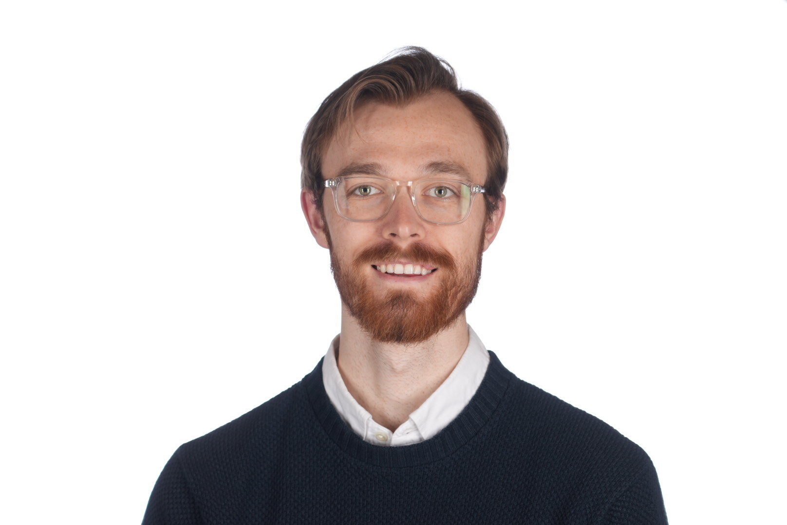

## About Me

I am a Ph.D. candidate in the [Machine Learning Research Group](https://github.com/tufts-ml/) at [Tufts University](https://www.tufts.edu/), advised by [Dr. Michael C. Hughes](https://www.michaelchughes.com/). I do research in machine learning for healthcare, with a focus on probabilistic machine learning and Bayesian deep learning.

I graduated with a B.S. in Computer Science and Mathematics minor from [Grove City College](https://www.gcc.edu/), where I worked with [Dr. Jonathan O. Hutchins](https://www.gcc.edu/Home/Academics/Faculty-Directory/Faculty-Detail/jonathan-o-hutchins) on acoustic gait analysis using unsupervised learning.

## News

**Nov 2023** Our paper was accepted as an archival Proceedings Track paper at the 3rd [*Machine Learning for Health (ML4H)*](https://ml4h.cc/2023/) symposium.

## Highlighted Pulications

* **Ethan Harvey**, Wansu Chen, David M. Kent, and Michael C. Hughes. A Probabilistic Method to Predict Classifier Accuracy on Larger Datasets given Small Pilot Data. In *Machine Learning for Health (ML4H)*, 2023. (40.3% acceptance rate)\
  [[Abstract](https://proceedings.mlr.press/v225/harvey23a.html)] [[PDF](https://proceedings.mlr.press/v225/harvey23a/harvey23a.pdf)] [[GitHub](https://github.com/tufts-ml/extrapolating-classifier-accuracy-to-larger-datasets)]
