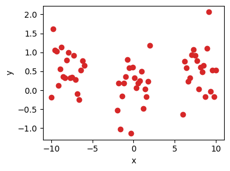
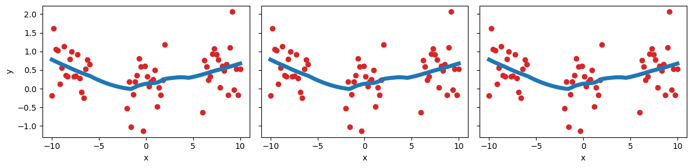

# A Bayesian Perspective of Weight Decay in PyTorch

*Ethan Harvey, Mikhail Petrov, Michael C. Hughes*

June 11, 2024

### What is weight decay?

Regularization is a common approach to reduce overfitting in deep learning models. Weight decay, also known as L2 regularization, reduces overfitting by adding the L2 norm of model parameters to the loss function. This penalty term is known as weight decay, because it biases parameter values toward the origin. Given a training dataset $\mathcal{D} = \\{x_i, y_i\\}_{i=1}^n$ and probabilistic model $p(y|x, \theta)$, we minimize the regularized negative log-likelihood

```math
    L(\theta) := \underbrace{- \frac{1}{n} \sum_{i=1}^n \log p(y_i|x_i, \theta)}_{f(\theta)}  + \frac{\lambda}{2} ||\theta||_2^2
```

where $f(\theta)$ is the (unpenalized) loss function (e.g., mean squared error, cross entropy) and $\lambda \in [0, \infty)$ is a hyperparameter that determines the relative weight of the penalty term compared to the loss function.

### How is weight decay implemented in PyTorch?

Stocastic gradient descent (SGD) in PyTorch implements weight decay via an efficient direct modification of the gradient vector. Given decay parameter $\lambda > 0$, at iteration $t$ the optimizer internally performs an additive incremental update of the gradient with respect to parameters: $\nabla_\theta f(\theta_{t-1}) \leftarrow \nabla_\theta f(\theta_{t-1}) + \lambda \theta_{t-1}$ where $f(\theta)$ is the (unpenalized) loss function (e.g., mean squared error, cross entropy). This direct modification is equivalent to, but more efficient than, automatic differentiation of a penalized loss that includes an L2 penalty term for $\theta$.

### A Bayesian interpretation

Weight decay in PyTorch has a Bayesian interpretation as maximum a-posteriori (MAP) estimation of parameters $\theta$, under the assumption that the parameters $\theta$ follow a Gaussian prior $\mathcal{N}(0, \tau I)$ with scalar precision parameter $\tau = \frac{1}{n\lambda}$. Rescaling by $n$ ensures that minimizing the above loss is equivalent to maximizing the per-example MAP objective: $\frac{1}{n} [ \log p(y|x, \theta) + \log p(\theta) ]$.

```math
\begin{align*} 
    p(\theta | \mathcal{D}) &\propto p(\mathcal{D} | \theta) p(\theta) &\qquad \text{by Bayes rule} \\
    &\propto - \log p(y|x, \theta) - \log p(\theta) &\qquad \text{negative log-likelihood} \\
    &\propto - \frac{1}{n} \log p(y|x, \theta) - \frac{1}{n} \log p(\theta) &\qquad \text{rescale by $1/n$} \\
    &\propto - \frac{1}{n} \log p(y|x, \theta) - \frac{1}{n} \log \mathcal{N}(\theta | 0, \tau I) &\qquad \text{TODO} \\
    &\propto - \frac{1}{n} \log p(y|x, \theta) - \frac{1}{n} \log \frac{1}{(2 \pi)^{D/2}} \frac{1}{|\tau I|^{1/2}} \exp \{ -\frac{1}{2} (\theta - 0)^T (\tau I)^{-1} (\theta - 0) \} &\qquad \text{TODO} \\
    &\propto - \frac{1}{n} \log p(y|x, \theta) + \frac{1}{n} \frac{1}{2 \tau} \theta^T \theta - \text{const} &\qquad \text{TODO} \\
    &\propto - \frac{1}{n} \log p(y|x, \theta) + \frac{1}{n} \frac{n \lambda}{2} ||\theta||_2^2 - \text{const} &\qquad \text{TODO} \\
    &\propto - \frac{1}{n} \log p(y|x, \theta) + \frac{\lambda}{2} ||\theta||_2^2 - \text{const} &\qquad \text{TODO}
\end{align*} 
```

### How to implement weight decay from scratch?

Import packages and initialized model.
```python
import time, numpy as np, matplotlib.pyplot as plt
# PyTorch
import torch
from torch.nn.utils import parameters_to_vector, vector_to_parameters
# Importing our custom module(s)
import models

model = models.Net()
```

Use randomly initialized model and Gaussian noise to generate labels.
```python
def featurize(x):
    return torch.cat([x[:, None], x[:, None]**2], dim=1)

x = torch.cat([torch.linspace(start=-10, end=-6, steps=20, dtype=torch.float),
               torch.linspace(start= -2, end= 2, steps=20, dtype=torch.float),
               torch.linspace(start=  6, end=10, steps=20, dtype=torch.float)])
f = featurize(x)
y = model(f).detach() + torch.randn(60,1)*0.5

ncols, nrows = 1, 1
fig, axs = plt.subplots(ncols=ncols, nrows=nrows, figsize=(4*ncols, 3*nrows))
axs.scatter(x, y, color='#D62728')
fig.tight_layout()
plt.show()
```



Reinitialized model and save parameters so we can train each model from the same initialization.
```python
def mse_loss(y_hat, y):
    return torch.mean((y - y_hat) ** 2)

def l2_penalty(params):
    return (1/2) * torch.sum(params ** 2)
```

TODO
```python
lr, weight_decay = 1e-2, 1e-2
model = models.Net()
init = parameters_to_vector(model.parameters()).detach().numpy()
optimizer = torch.optim.SGD(model.parameters(), lr=lr)
```

TODO
```python
start = time.time()
from_scratch_grads = []
for epoch in range(1_000):
    optimizer.zero_grad()
    y_hat = model(f)
    nll = mse_loss(y_hat, y)
    loss = nll + weight_decay * l2_penalty(parameters_to_vector(model.parameters()))
    loss.backward()
    if epoch < 5:
        print(f'Epoch: {epoch}, NLL: {nll.item()}')
        grads = torch.cat([param.grad.view(-1) for param in model.parameters()]).detach().numpy()
        from_scratch_grads.append(grads)
    optimizer.step()

linspace = torch.linspace(start=-10, end=10, steps=100, dtype=torch.float)
from_scratch_preds = model(featurize(linspace))
end = time.time()
print(f'Elapsed time: {end - start}')
```
```math
\begin{flalign*}
    &\texttt{Epoch: 0, NLL: 0.6727076768875122} & \\
    &\texttt{Epoch: 1, NLL: 0.47100338339805603} & \\
    &\texttt{Epoch: 2, NLL: 0.5295957922935486} & \\
    &\texttt{Epoch: 3, NLL: 0.4758244454860687} & \\
    &\texttt{Epoch: 4, NLL: 0.4135437607765198} & \\
    &\texttt{Elapsed time: 0.880873441696167} &
\end{flalign*}
```

TODO
```python
model = models.Net()
vector_to_parameters(torch.tensor(init), model.parameters())
optimizer = torch.optim.SGD(model.parameters(), lr=1e-2, weight_decay=weight_decay)
```

TODO
```python
start = time.time()
pytorch_grads = []
for epoch in range(1_000):
    optimizer.zero_grad()
    y_hat = model(f)
    nll = mse_loss(y_hat, y) 
    nll.backward()
    if epoch < 5:
        print(f'Epoch: {epoch}, NLL: {nll.item()}')
        params = torch.cat([param.view(-1) for param in model.parameters()]).detach().numpy()
        grads = torch.cat([param.grad.view(-1) for param in model.parameters()]).detach().numpy()
        grads = grads + weight_decay*params
        pytorch_grads.append(grads)
    optimizer.step()

pytorch_preds = model(featurize(linspace))
end = time.time()
print(f'Elapsed time: {end - start}')
```

TODO
```python
for from_scratch_grad, pytorch_grad in zip(from_scratch_grads, pytorch_grads):
    print(np.linalg.norm(from_scratch_grad - pytorch_grad))
```
```math
\begin{flalign*}
    &\texttt{0.0} & \\
    &\texttt{0.0} & \\
    &\texttt{0.0} & \\
    &\texttt{0.0} & \\
    &\texttt{0.0} &
\end{flalign*}
```

TODO
```python
model = models.Net()
vector_to_parameters(torch.tensor(init), model.parameters())
optimizer = torch.optim.SGD(model.parameters(), lr=lr)
tau = 1/(len(y)*weight_decay)
prior = torch.distributions.normal.Normal(0, np.sqrt(tau))
```

TODO
```python
start = time.time()
bayesian_grads = []
for epoch in range(1_000):
    optimizer.zero_grad()
    y_hat = model(f)
    nll = mse_loss(y_hat, y) 
    loss = nll - (1/len(y)) * torch.sum(prior.log_prob(parameters_to_vector(model.parameters())))
    #loss = nll - (1/len(y)) * - (1 / (2 * tau)) * torch.sum(np.log(1/np.sqrt(2 * np.pi * tau)) / - (1 / (2 * tau)) + (parameters_to_vector(model.parameters()) - 0) ** 2)
    loss.backward()
    if epoch < 5:
        print(f'Epoch: {epoch}, NLL: {nll.item()}')
        grads = torch.cat([param.grad.view(-1) for param in model.parameters()]).detach().numpy()
        bayesian_grads.append(grads)
    optimizer.step()

bayesian_preds = model(featurize(linspace))
end = time.time()
print(f'Elapsed time: {end - start}')
```
```math
\begin{flalign*}
    &\texttt{Epoch: 0, NLL: 0.6727076768875122} & \\
    &\texttt{Epoch: 1, NLL: 0.47100338339805603} & \\
    &\texttt{Epoch: 2, NLL: 0.5295957922935486} & \\
    &\texttt{Epoch: 3, NLL: 0.4758244454860687} & \\
    &\texttt{Epoch: 4, NLL: 0.4135437607765198} & \\
    &\texttt{Elapsed time: 0.9935193061828613} &
\end{flalign*}
```

TODO
```python
for bayesian_grad, pytorch_grad in zip(bayesian_grads, pytorch_grads):
    print(np.linalg.norm(bayesian_grad - pytorch_grad))
```
```math
\begin{flalign*}
    &\texttt{4.2720878e-08} & \\
    &\texttt{1.1872358e-08} & \\
    &\texttt{3.161624e-08} & \\
    &\texttt{9.324012e-09} & \\
    &\texttt{8.653672e-09} &
\end{flalign*}
```

TODO
```python
ncols, nrows = 3, 1
fig, axs = plt.subplots(ncols=ncols, nrows=nrows, figsize=(4*ncols, 3*nrows))
axs[0].scatter(x, y, color='#D62728')
axs[0].plot(linspace.data.numpy(), from_scratch_preds.data.numpy(), color='#1F77B4', lw=5)
axs[1].scatter(x, y, color='#D62728')
axs[1].plot(linspace.data.numpy(), pytorch_preds.data.numpy(), color='#1F77B4', lw=5)
axs[2].scatter(x, y, color='#D62728')
axs[2].plot(linspace.data.numpy(), bayesian_preds.data.numpy(), color='#1F77B4', lw=5)
fig.tight_layout()
plt.show()
```




### References

[1] Ethan Harvey, Mikhail Petrov, and Michael C. Hughes. Transfer Learning with Informative Priors: Simple Baselines Better than Previously Reported. *Transactions on Machine Learning Research (TMLR)*, 2024. ISSN 2835-8856.
